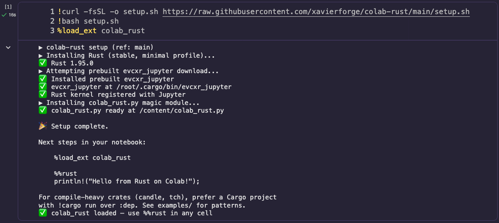
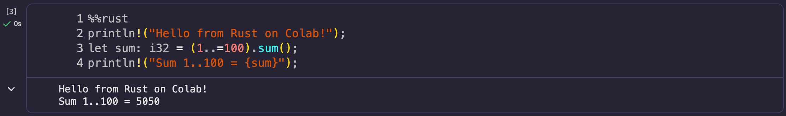

# colab-rust

> Run Rust on Google Colab in **~17 seconds**. Prebuilt binaries, auto-updated weekly via CI.

_Measured on Colab free tier after the `prebuilt-latest` release is published. Source-fallback (if prebuilt is unavailable) takes ~10 minutes._

[](https://github.com/xavierforge/colab-rust/actions/workflows/build-prebuilts.yml)
[](https://colab.research.google.com/github/xavierforge/colab-rust/blob/main/examples/01_hello.ipynb)
[](LICENSE)

## Quick Start

```python
!curl -fsSL -o setup.sh https://raw.githubusercontent.com/xavierforge/colab-rust/main/setup.sh
!bash setup.sh
%load_ext colab_rust
```



```rust
%%rust
println!("Hello from Rust on Colab!");
let sum: i32 = (1..=100).sum();
println!("Sum 1..100 = {sum}");
```



State persists across `%%rust` cells, you can mix freely with Python in the
same notebook, and crates work via `:dep`:

```rust
%%rust
:dep rand = "0.8"
use rand::Rng;
rand::thread_rng().gen_range(1..=100)
```

## How it compares

Two earlier approaches exist:

- **[wiseaidev's gist](https://gist.github.com/wiseaidev/2af6bef753d48565d11bcd478728c979)**
  installs a prebuilt evcxr via Nix and switches the Colab runtime to a
  Rust kernel through an IPC proxy. It sets up in ~2 minutes and works
  reliably — but only on the **CPU runtime**; on a GPU runtime the proxy
  fails to connect. Because it replaces the Python kernel, you also can't
  mix Python and Rust in one notebook.
- **[korakot's gist](https://gist.github.com/korakot/ae95315ea6a3a3b33ee26203998a59a3)**
  is a kernel-switch variant that's reportedly no longer working on
  current Colab.

`colab-rust` takes a different route:

- **Prebuilt via GitHub Releases, not Nix.** GitHub Actions compiles
  `evcxr_jupyter` once a week on `ubuntu-22.04` (matching Colab's glibc
  2.35) and publishes it as a Release asset; `setup.sh` just downloads it
  (~17s). Compiling from source takes ~11 minutes — that's the cost we
  pre-pay so you don't have to. If the download fails, setup falls back to
  source compilation automatically.
- **A subprocess, not a kernel switch.** You stay on the Python runtime;
  evcxr runs as a subprocess via `jupyter_client`, exposed through a
  `%%rust` magic. This is why it works on **GPU runtimes** and why you can
  mix Python and Rust in the same notebook with errors staying visible.

Benefits in short:

- **Mix languages** — Python loads data, Rust crunches, Python plots.
- **State persists** across `%%rust` cells, like a real REPL.
- **GPU runtimes work** — verified Rust → CUDA execution on Colab's T4
  (a candle matmul lands on `cuda:0`).

Limitations:

- **Output is buffered, not streamed.** evcxr compiles each cell into a
  binary and flushes stdout when it finishes, so a loop like
  `for i in 0..1000 { println!("{i}"); }` prints all at once at the end,
  not line by line.
- **Interrupting is shallow.** Pressing stop raises `KeyboardInterrupt`
  in the Python front-end, but the evcxr subprocess keeps running its
  current cell, and its buffered output can surface at the start of your
  next `%%rust` cell. To fully stop, reset the kernel.
- **Python-based highlighting only.** Colab colors strings and numbers in
  `%%rust` cells but doesn't recognize Rust keywords (`fn`, `let`,
  `match`). For full IDE support, write a Cargo project in `/content/`
  and run it with `!cargo run`.

## Why this exists

In [evcxr/evcxr#147](https://github.com/evcxr/evcxr/issues/147) (2024),
the evcxr maintainer wrote:

> "I'd been meaning to try to figure out if the process could be
> streamlined somewhat. e.g. do automatic builds pushed to Google Drive."

This repo implements that idea, with GitHub Actions + GitHub Releases
instead of Google Drive: stable URLs, no auth, version history, and an
automatic weekly refresh.

## GPU / heavy crates

For crates with large build steps (candle, tch — anything pulling NVCC),
**prefer a Cargo project + `!cargo run` over `:dep`**. evcxr recompiles
the whole sketch on every `:dep` change, which is fine for small libs but
painful for candle (~11 min cold).

Approximate cold-build times on Colab T4:

| Crate                            | Cold build | Notes                                  |
| -------------------------------- | ---------- | -------------------------------------- |
| `cudarc`                         | ~30s       | Pure FFI binding, no CUDA compile      |
| `candle-core` (minimal cuda)     | ~8min      | Compiles essential kernels             |
| `candle-core` (default features) | ~11min     | Compiles GGUF / flash-attn kernels too |
| `tch-rs` (libtorch)              | ~3min      | Downloads prebuilt libtorch            |

Cache your `target/` directory to Google Drive to skip rebuilds on
cold-start sessions:

```python
from google.colab import drive
drive.mount('/content/drive')

# Backup after a clean build
!tar czf /content/drive/MyDrive/colab-rust-cache/target.tar.gz \
    -C /content/myproject target/

# Restore in a fresh session
!tar xzf /content/drive/MyDrive/colab-rust-cache/target.tar.gz \
    -C /content/myproject
```

A worked candle GPU example is coming in v0.2 (see roadmap).

## Tested on

- Colab free tier (Python 3.12, Ubuntu 22.04.5 LTS, glibc 2.35)
- Colab T4 GPU runtime (verified candle CUDA matmul works)
- evcxr_jupyter 0.21.1
- Rust stable (1.80+)

If you hit `GLIBC_X.YZ not found`, your Colab base image has probably been
upgraded — please open an issue. Setup falls back to source compilation in
that case.

## Roadmap

- [x] v0.1.0 — Prebuilt evcxr_jupyter, `%%rust` magic, weekly auto-build
- [ ] v0.2 — `cudarc` GPU quickstart, `target/` Drive cache helper
- [ ] v0.3 — Ubuntu version auto-detection + matrix build (24.04 readiness)
- [ ] v1.0 — Experimental `cuda-oxide` support (depends on LLVM 21+
      becoming installable in Colab without breaking the kernel)

See [open issues](https://github.com/xavierforge/colab-rust/issues) for
detail.

## Contributing

PRs welcome. Most useful right now:

- Test on Colab Pro / Pro+ runtimes (A100, V100, L4) and report any
  glibc / kernel registration issues.
- Add a Windows / WSL setup guide.
- Examples in your own language — README is currently English-only.

## Credits

- [wiseaidev's evcxr Colab gist](https://gist.github.com/wiseaidev/2af6bef753d48565d11bcd478728c979)
  — the inspiration that demonstrated this could work at all.
- [korakot's gist](https://gist.github.com/korakot/ae95315ea6a3a3b33ee26203998a59a3)
  — the alternative kernel-switching approach.
- [David Lattimore](https://github.com/davidlattimore) and the evcxr
  maintainers — for building the foundational REPL that everything here
  depends on, and for suggesting the auto-build approach in
  [evcxr#147](https://github.com/evcxr/evcxr/issues/147).

## License

MIT — see [LICENSE](LICENSE).
