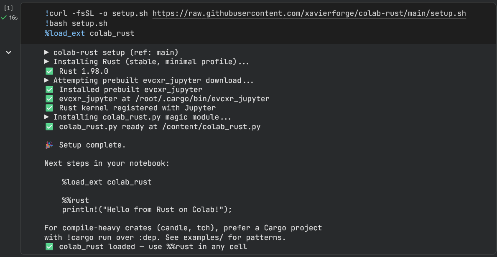
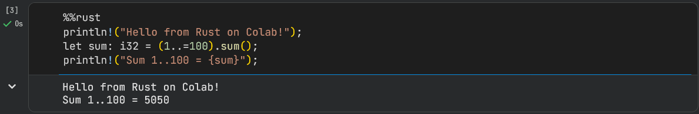
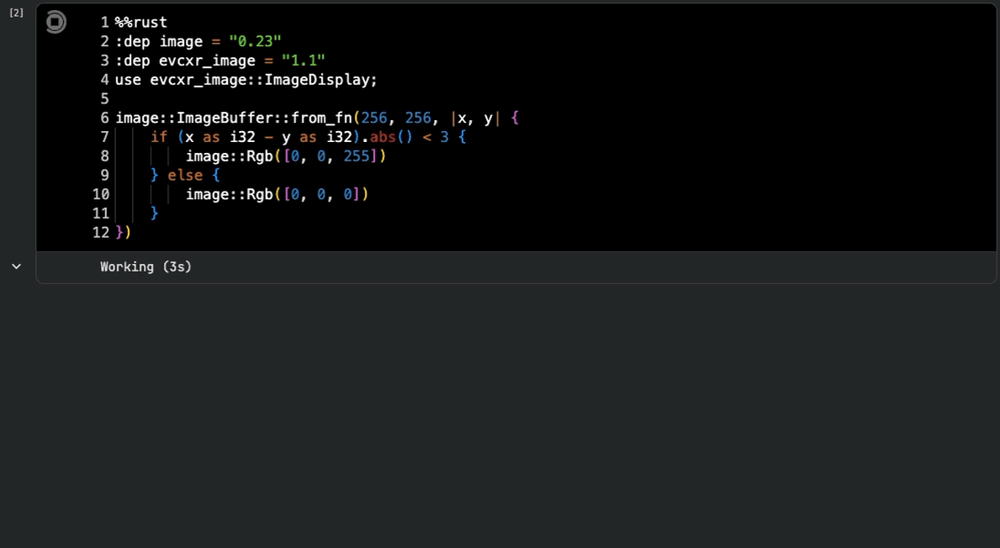

# colab-rust

> Write Rust in Google Colab with a `%%rust` cell magic: setup in **~17 seconds**, works on GPU runtimes. Prebuilt binaries, auto-updated weekly.

_Measured on Colab free tier after the `prebuilt-latest` release is published; last verified 2026-09-01 (16-18s across CPU and T4 runtimes). Source-fallback (if prebuilt is unavailable) takes ~10 minutes._

[](https://github.com/xavierforge/colab-rust/actions/workflows/build-prebuilts.yml)
[](https://colab.research.google.com/github/xavierforge/colab-rust/blob/main/examples/01_hello.ipynb)
[](LICENSE)

## Quick Start

```python
!curl -fsSL -o setup.sh https://raw.githubusercontent.com/xavierforge/colab-rust/main/setup.sh
!bash setup.sh
%load_ext colab_rust
```



```rust
%%rust
println!("Hello from Rust on Colab!");
let sum: i32 = (1..=100).sum();
println!("Sum 1..100 = {sum}");
```



State persists across `%%rust` cells, you can mix freely with Python in the
same notebook, and crates work via `:dep`:

```rust
%%rust
:dep rand = "0.8"
use rand::Rng;
rand::thread_rng().gen_range(1..=100)
```

## Rich output and build progress

A `:dep` compile shows what cargo is doing instead of a bare spinner, and anything evcxr can display renders inline.



```rust
%%rust
:dep image = "0.23"
:dep evcxr_image = "1.1"
use evcxr_image::ImageDisplay;

image::ImageBuffer::from_fn(256, 256, |x, y| {
    if (x as i32 - y as i32).abs() < 3 { image::Rgb([0, 0, 255]) } else { image::Rgb([0, 0, 0]) }
})
```

HTML from `evcxr_display()` renders as well, stdout and stderr keep their own streams, and pressing stop actually interrupts the running cell. [examples/02_rich_output.ipynb](https://colab.research.google.com/github/xavierforge/colab-rust/blob/main/examples/02_rich_output.ipynb) walks through each of these.

## How it compares

Two earlier approaches exist:

- **[wiseaidev's gist](https://gist.github.com/wiseaidev/2af6bef753d48565d11bcd478728c979)**
  installs evcxr via Nix and switches the Colab runtime to a Rust kernel.
  Setup takes 1-3 minutes, and the script as published fails on GPU
  runtimes (its `/opt/bin` symlink collides with a directory that exists
  on Colab's GPU image). With that patched, a plain Rust kernel does
  connect on a T4, but the workflow is fragile: the setup cell has to be
  run from the Python runtime, and run twice before the kernel shows up;
  the IPC-proxy "Rust-TCP" variant did not finish connecting in our
  tests; and picking the wrong kernel means starting over. On the plus
  side, a real Rust kernel gets proper Rust syntax highlighting and
  evcxr's native rich output, which a `%%rust` cell magic has to
  reimplement. Because it replaces the Python kernel, you also can't mix
  Python and Rust in one notebook.
- **[korakot's gist](https://gist.github.com/korakot/ae95315ea6a3a3b33ee26203998a59a3)**
  is a kernel-switch variant that's reportedly no longer working on
  current Colab.

`colab-rust` takes a different route:

- **Prebuilt via GitHub Releases, not Nix.** GitHub Actions compiles
  `evcxr_jupyter` once a week on `ubuntu-22.04` (matching Colab's glibc
  2.35) and publishes it as a Release asset; `setup.sh` just downloads it
  (~17s). Compiling from source takes ~11 minutes — that's the cost we
  pre-pay so you don't have to. If the download fails, setup falls back to
  source compilation automatically.
- **A subprocess, not a kernel switch.** You stay on the Python runtime;
  evcxr runs as a subprocess via `jupyter_client`, exposed through a
  `%%rust` magic. You never touch Colab's runtime settings, and if the
  Rust side wedges, `%rust_reset` restarts it in seconds instead of a
  reinstall. You can mix Python and Rust in the same notebook with errors
  staying visible, and it works on **GPU runtimes** the same way.

Benefits in short:

- **Mix languages** — Python loads data, Rust crunches, Python plots.
- **State persists** across `%%rust` cells, like a real REPL.
- **GPU runtimes work** — verified Rust → CUDA execution on Colab's T4
  (a candle matmul lands on `cuda:0`).
- **Rich output renders inline**: HTML from `evcxr_display()` and images
  from `evcxr_image` show up as tables and pictures, not blank cells.
- **Build progress shows in place**: a `:dep` compile displays which crate
  cargo is on and how long it has been running, instead of a bare spinner.

Limitations:

- **Output is buffered, not streamed.** evcxr compiles each cell into a
  binary and flushes stdout when it finishes, so a loop like
  `for i in 0..1000 { println!("{i}"); }` prints all at once at the end,
  not line by line.
- **Interrupting costs your variables.** Pressing stop sends a real
  interrupt to the evcxr kernel, which kills the code that is running, so
  the cell actually stops. The price is that evcxr restarts its runtime
  subprocess: everything earlier cells defined with `fn`, `struct`, `mod` or
  `:dep` survives, but all variable bindings are gone, and so is anything the
  interrupted cell itself was defining.
  Requires an evcxr 0.22.0 prebuilt (anything installed from 2026-09-01
  onwards).
- **Python-based highlighting only.** Colab colors strings and numbers in
  `%%rust` cells but doesn't recognize Rust keywords (`fn`, `let`,
  `match`). For full IDE support, write a Cargo project in `/content/`
  and run it with `!cargo run`.

## Why this exists

In [evcxr/evcxr#147](https://github.com/evcxr/evcxr/issues/147) (2024),
the evcxr maintainer wrote:

> "I'd been meaning to try to figure out if the process could be
> streamlined somewhat. e.g. do automatic builds pushed to Google Drive."

This repo implements that idea, with GitHub Actions + GitHub Releases
instead of Google Drive: stable URLs, no auth, version history, and an
automatic weekly refresh.

## GPU / heavy crates

For crates with large build steps (candle, tch — anything pulling NVCC),
**prefer a Cargo project + `!cargo run` over `:dep`**. evcxr recompiles
the whole sketch on every `:dep` change, which is fine for small libs but
painful for candle (~11 min cold).

Approximate cold-build times on Colab T4:

| Crate                            | Cold build | Notes                                  |
| -------------------------------- | ---------- | -------------------------------------- |
| `cudarc`                         | 10s        | Measured 2026-09-10 on a T4; no NVCC   |
| `candle-core` (minimal cuda)     | ~8min      | Compiles essential kernels             |
| `candle-core` (default features) | ~11min     | Compiles GGUF / flash-attn kernels too |
| `tch-rs` (libtorch)              | ~3min      | Downloads prebuilt libtorch            |

Cache your `target/` directory to Google Drive to skip rebuilds on
cold-start sessions:

```python
from google.colab import drive
drive.mount('/content/drive')

# Backup after a clean build
!tar czf /content/drive/MyDrive/colab-rust-cache/target.tar.gz \
    -C /content/myproject target/

# Restore in a fresh session
!tar xzf /content/drive/MyDrive/colab-rust-cache/target.tar.gz \
    -C /content/myproject
```

[examples/03_cudarc_gpu.ipynb](https://colab.research.google.com/github/xavierforge/colab-rust/blob/main/examples/03_cudarc_gpu.ipynb) compiles a CUDA kernel with nvrtc and launches it from a `%%rust` cell on a T4: `:dep cudarc` builds in 10 s, the kernel adds a million floats in 2 s wall time including the PTX compile.

A worked candle GPU example is still on the roadmap.

## Rust CUDA kernels with cuda-oxide

[cuda-oxide](https://github.com/NVlabs/cuda-oxide) compiles Rust functions to PTX through a rustc codegen backend. On a T4 runtime, one extra script puts that toolchain behind `%%rust`, so a `#[kernel]` written in a cell compiles and launches from the next line:

```python
!curl -fsSL -o /tmp/setup-cuda-oxide.sh https://raw.githubusercontent.com/xavierforge/colab-rust/main/setup-cuda-oxide.sh
!bash /tmp/setup-cuda-oxide.sh
%load_ext colab_rust
```

[examples/04_cuda_oxide.ipynb](https://colab.research.google.com/github/xavierforge/colab-rust/blob/main/examples/04_cuda_oxide.ipynb) has the full walk-through: the `%%rust` configuration cell, a vecadd kernel, and GPU buffers reused across cells.

Measured on fresh T4 sessions (2026-09-16, three runs): the script takes about 90 s, the configuration cell that pulls in cuda-oxide's crates about 95 s, and a kernel then compiles and runs in a few seconds; roughly 3 minutes from a blank runtime to the first launch. The script installs a minimal CUDA 13.4 toolkit (740 MB), clang-21, the nightly cuda-oxide pins, an exact cuda-oxide checkout, and a prebuilt codegen backend from this repository's releases (source build as fallback, about 5 minutes more). It refuses anything but a Tesla T4 on the Ubuntu 24.04 image, because that is all that has been tested.

What is pinned: cuda-oxide commit `6abfaa09` (2026-09-11), `nightly-2026-08-28`, `cuda-core` 0.3.1, CUDA 13.4. cuda-oxide is alpha software and moves fast; bumps are deliberate and re-tested. `COLAB_CUDA_OXIDE_REF` overrides the commit if you want to try a newer one.

Why a loader crate: cuda-oxide's generated `kernels::load()` reads the embedded PTX from the running executable, which under evcxr is the runtime process rather than the cell's shared object. The small `colab-cuda-oxide` crate reads it from the cell's own object instead, through `load_kernels!(&ctx, kernels)`. That is a workaround until upstream grows a path-aware loader.

## Tested on

- Colab free tier, CPU and T4 runtimes, on the Ubuntu 24.04 image (glibc 2.39, CUDA 12.8, driver 580) as of 2026-09-10; the 22.04-built prebuilt runs on it unchanged. Also verified on the previous 22.04.5 image (glibc 2.35) through 2026-09-04.
- On the T4: cudarc kernel launch from a `%%rust` cell, a candle CUDA matmul from a Cargo project, and cuda-oxide `#[kernel]` compilation and launch inside `%%rust` cells (2026-09-16)
- evcxr_jupyter 0.22.0
- Rust stable (1.98 at last verification; the source fallback needs ≥ 1.95, evcxr's MSRV)

The prebuilt is compiled on Ubuntu 22.04 against glibc 2.35, so it runs on any newer Colab image as well; setup only warns and falls back to source compilation if it finds an older glibc.

## Roadmap

- [x] v0.1.0 — Prebuilt evcxr_jupyter, `%%rust` magic, weekly auto-build
- [x] v0.1.2 to v0.1.4 — Real interrupt, build progress, rich output, separate stderr
- [x] `cudarc` GPU quickstart (`examples/03_cudarc_gpu.ipynb`)
- [x] v0.2.0 — `cuda-oxide` kernels inside `%%rust` cells on T4 (`setup-cuda-oxide.sh`, `examples/04_cuda_oxide.ipynb`)
- [ ] `target/` Drive cache helper
- [ ] Upstream path-aware loader in cuda-oxide, so the `colab-cuda-oxide` crate can go away
- [ ] cuda-oxide on other Colab GPUs (L4, A100) once measured

See [open issues](https://github.com/xavierforge/colab-rust/issues) for
detail.

## Contributing

PRs welcome. Most useful right now:

- Test on Colab Pro / Pro+ runtimes (A100, V100, L4) and report any
  glibc / kernel registration issues.
- Add a Windows / WSL setup guide.
- Examples in your own language — README is currently English-only.

## Credits

- [wiseaidev's evcxr Colab gist](https://gist.github.com/wiseaidev/2af6bef753d48565d11bcd478728c979)
  — the inspiration that demonstrated this could work at all.
- [korakot's gist](https://gist.github.com/korakot/ae95315ea6a3a3b33ee26203998a59a3)
  — the alternative kernel-switching approach.
- [David Lattimore](https://github.com/davidlattimore) and the evcxr
  maintainers — for building the foundational REPL that everything here
  depends on, and for suggesting the auto-build approach in
  [evcxr#147](https://github.com/evcxr/evcxr/issues/147).
- [NVlabs/cuda-oxide](https://github.com/NVlabs/cuda-oxide) — the Rust-to-PTX
  codegen backend behind `examples/04_cuda_oxide.ipynb`.
- Background: the author's numba CUDA teaching series
  ([part 1](https://xavierforge.dev/posts/numba-cuda-puzzles-1/),
  [part 2](https://xavierforge.dev/posts/numba-cuda-puzzles-2/)), the
  Python-side CUDA material that led to this project.

## License

MIT — see [LICENSE](LICENSE).
